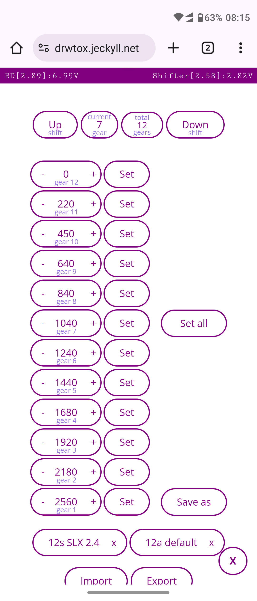
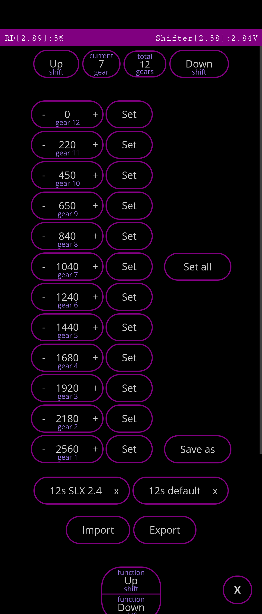
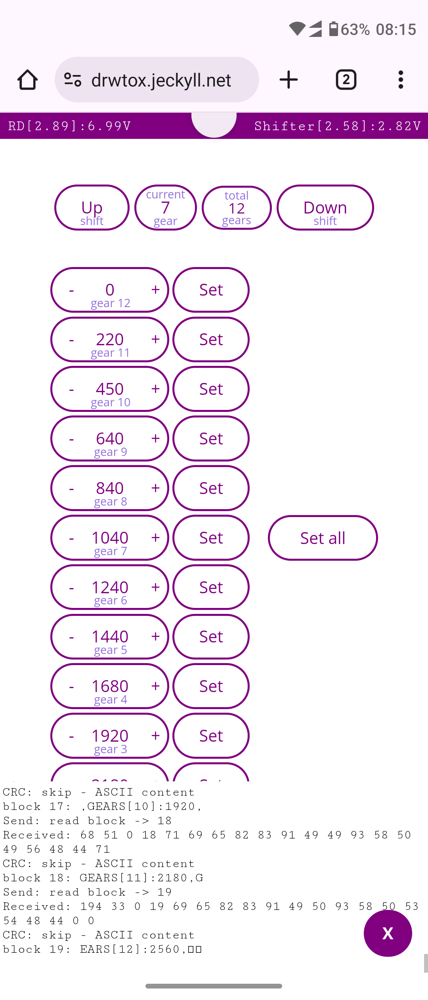
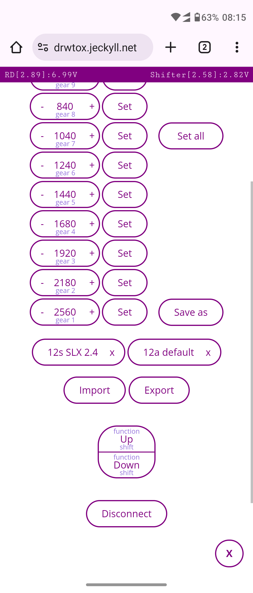
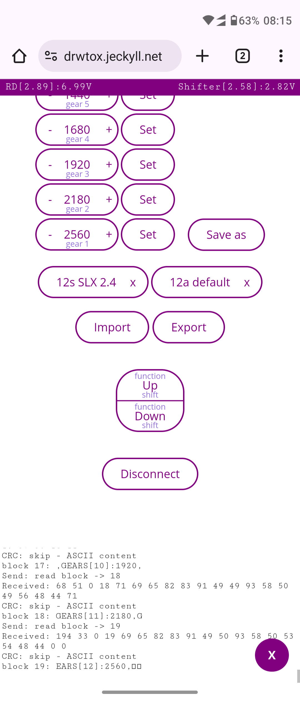
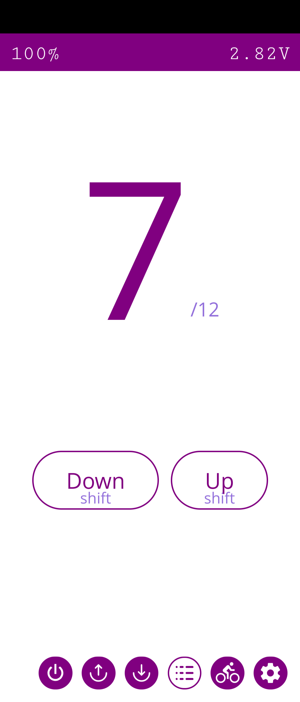

# Open source WEB/PWA app
This repo now contain open source WEB/PWA app for EDS OX/TX/GeX which is hosted at https://dreds.jeckyll.net/.

APK file can be downloaed from: https://dreds.jeckyll.net/releases/1.0.0.0/drEDS-1.0.0.0.apk (buld from published source trough APK Builder)

You can clone repo and host it yourself or use it from supplied URL.

### What's working:

- Displaying battery voltages - FD, RD and shifter
- Displaying firmware versions - FD, RD and shifter
- Up/Down shifting - click on Up/Down shift buttons
- Set number of gears (3/14) - click on `total gears` button and select from drop down list - allow to set number of gears only if you are on lower than selected gear to prevent errors
- Initial calibration - will show up/down buttons only when RD is on smallest gear or FD is on largest chainring to prevent user errors
- Adjust every gear value - use `+` and `-` buttons or enter value - click `Set`
- Adjust FD limits - - use `+` and `-` buttons or enter value - click `Set`
- Set all gear RD values or FD limits - click `Set all` button
- Save values as preset - click `Save as` - enter name - use only letters and numbers - you will see new button with that name to appear - presets are displayed by device type i.e. preset for OX wont't be displayed when app is connected to TX
- Export - click `Export` button - file with all current values, limits and all presets will be saved on your device with file name `drEDS-[date/time].json`
- Import - Click on `Import` button to import exported file - all current and saved as preset values will be overwritten, but not uploaded to a RD - use `Set all` to upload to RD
- Presets - all saved presets are displayed as buttons with option to be deleted - clicking on preset will put all values from it, on edit boxes, but not be uploaded to RD - click `Set all` to upload them to RD
- Button functions - OX - normal (top button up shift/bottom button downshift) and reverse (top button down shift/bottom button up shift) buttons functions, TX, GeX - each button can be configured to switch FD or up/down for RD
- Light and Dark theme support - follow device preferences
- battery voltage/percentage display - click on title bar to switch
- Race mode (experimental) - official app use `competitive mode` - can be turned on or off independent from `sleep mode`
- Sleep mode (TX, GeX only - experimental) - official app use `casual mode` - can be turned on or off independent from `race mode`
- Live view - useful if riding with a phone - display gear, battery and allow shifting

### What's missing:

- Offline mode - at that point app load all need files from Internet. On later stage it may become entirely offline
- Firmware upgrade - if it is even possible, since it require some AES encryption
- Please, feel free to add more ...

### What may be added:
- RD protection (TX only) - when on smallest chainring don't allow RD to go to two smallest cogs
- FD, RD thresholds - need more research actual functions - for now it is known only that RD treshold=1 is race mode, treshold=2 is normal mode. FD also have treshold, but it is uknown for what is used.

### Requirements:

- Google chrome/Brave/Vivaldi browser (may be other Chromium based browsers) installed on the device - Firefox don't support WEB Bluetooth, Opera don't work for some reason
- Enabled WEB Bluetooth on the browser - check for WEB Bluetooth in `chrome://flags`, `brave://flags` & etc (new Chrome and Vivaldi versions have flag enabled, Brave have it disabled) and enable flag if needed
- Internet access - at least for now
- Bluetooth

### Something not working: 

Make sure `logs` button in the menu is pressed and debug messages are visible, then douple tap on them and logs will be copied to the clipboard. Open new issue here and paste debug information, so it can be analized and problem to be fixed.

### Sreenshots OX:
{width=33%}
{width=33%}
{width=33%}
{width=233}
{width=33%}
{width=33%}

## More information
- [General EDS OX information](EDS-OX.md)
- [App protocol](PROTOCOL-APP.md)
- [Shifter protocol](PROTOCOL-SHIFTER.md)
- [Information about EDS official app](EDS-APP.md)
- [Hardware demos](HARDWARE.md)
- [MQTT information](MQTT.md)
- [How to debug EDS](HOWTO.md)

# DISCLAIMER
This information is only for educational and personal use.

I'm not responsible if you damge your EDS OX. 